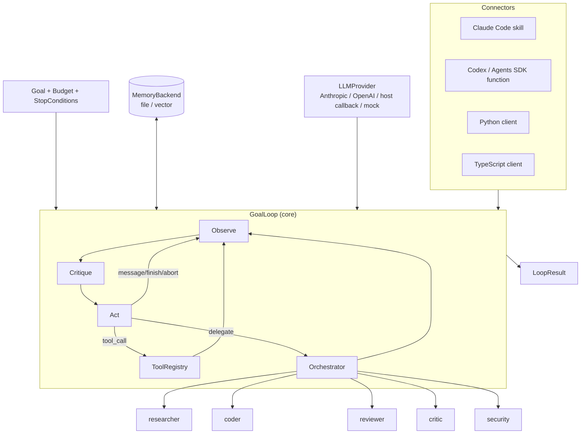

# SelfPrompt

**Stop manually prompting. Define a goal and let it run.**

SelfPrompt is a lightweight, framework-agnostic self-prompting / agentic
loop engine. Point it at a goal, give it tools and a stop condition, and it
iterates — observe, critique, act — until the goal is met or a budget runs
out. It drops into Claude Code, OpenAI Codex, Cursor, Continue, Aider, or a
bare Python script, because it doesn't assume any of them.

```bash
pip install git+https://github.com/iamkallolpratim/selfprompt.git
selfprompt init
selfprompt run "refactor payments/legacy.py to remove the global singleton, keep tests green" --provider anthropic
```

That's the whole quickstart. Under two minutes if `ANTHROPIC_API_KEY` is
already set.

Not on PyPI yet — pick whichever install fits:

```bash
# From GitHub directly (recommended for most users)
pip install git+https://github.com/iamkallolpratim/selfprompt.git

# With optional model backends
pip install "selfprompt[anthropic] @ git+https://github.com/iamkallolpratim/selfprompt.git"

# Local clone, editable (for contributing / hacking on the loop itself)
git clone https://github.com/iamkallolpratim/selfprompt.git
cd selfprompt
python3 -m venv .venv && source .venv/bin/activate   # any Python 3.9+
pip install -e ".[dev]"

# Build a wheel and share the file directly
python -m build   # needs: pip install build
pip install dist/selfprompt-0.1.0-py3-none-any.whl
```

## Philosophy

- **The loop is the product, not the prompt.** A single clever prompt gets
  you one good response. A bounded loop with self-critique and memory gets
  you a finished task.
- **Memory and verification are first-class citizens**, not bolted on.
  Every turn is persisted; every action is judged before the next one is
  taken; "done" means verified, not asserted.
- **Simplicity and composability over heavy frameworks.** A specialist
  agent is a YAML file. A tool is a Python object with a `.run()` method. A
  stop condition is a function. Nothing here requires learning a DSL.
- **Infrastructure, not a chatbot wrapper.** SelfPrompt has no UI and no
  opinion about which model you use — it's the loop, the memory, and the
  guardrails around them.

## Architecture



Every box is swappable: bring your own `LLMProvider`, your own `Tool`s, your
own `MemoryBackend`, your own specialist YAML files. The loop itself never
imports a specific model vendor or host.

## Core concepts

| Concept | What it is | Where |
|---|---|---|
| `GoalLoop` | The engine: observe → critique → act, bounded by a `Budget` | [`core/loop.py`](src/selfprompt/core/loop.py) |
| `Budget` | Hard caps: max turns, max tokens, max cost | [`core/state.py`](src/selfprompt/core/state.py) |
| `StopCondition` | A predicate over turns that ends the loop early, on success | [`core/state.py`](src/selfprompt/core/state.py) |
| `MemoryBackend` | Persists every turn + extracted lessons; `FileMemory` (default) or `VectorMemory` | [`memory/`](src/selfprompt/memory/) |
| `ToolRegistry` | Tools + a permission model (`allow` / `ask` / `deny`) for dangerous ones | [`tools/registry.py`](src/selfprompt/tools/registry.py) |
| `AgentSpec` | A specialist agent defined in one YAML file | [`agents/spec.py`](src/selfprompt/agents/spec.py) |
| `Orchestrator` | Routes delegated sub-goals to the right specialist | [`agents/orchestrator.py`](src/selfprompt/agents/orchestrator.py) |

### The turn cycle

Each turn, the model is asked for exactly one structured decision:

```json
{
  "observation": "what is the current state of the goal",
  "critique": {
    "progress_made": true,
    "confidence": 0.8,
    "issues": ["anything that went wrong"],
    "notes": ""
  },
  "action": {
    "type": "tool_call | delegate | message | finish | abort",
    "detail": "what and why",
    "tool_name": "...",
    "tool_args": {},
    "delegate_agent": "..."
  }
}
```

The critique is not decorative: a turn with `progress_made: false` or
non-empty `issues` gets its lesson auto-extracted into memory, so the *next*
turn — and the next run, next week — sees it.

## Quickstart

```bash
pip install git+https://github.com/iamkallolpratim/selfprompt.git   # add [anthropic] or [openai] extras for real model backends
selfprompt init                     # writes .selfprompt/config.yaml
selfprompt run "your goal here"     # runs with .selfprompt/config.yaml settings
selfprompt status                   # list goals with recorded progress
selfprompt status <goal-id>         # show full progress + lessons for one goal
```

Try it fully offline first with the zero-setup mock provider:

```bash
selfprompt run "say hello" --provider mock
```

### As a library

```python
from selfprompt.connectors import SelfPromptClient
from selfprompt.core.llm import AnthropicProvider
from selfprompt.core.state import Budget, StopCondition

client = SelfPromptClient(llm=AnthropicProvider(model="claude-sonnet-5"))

result = client.run(
    "Write a report on X and save it to out/report.md",
    budget=Budget(max_turns=15, max_cost_usd=1.00),
    stop_conditions=[StopCondition("report_exists", lambda turns: turns and "report.md" in turns[-1].result)],
    on_message=print,
)

print(result.finished, result.stop_reason)
```

### Multi-agent mode

```python
client = SelfPromptClient(llm=AnthropicProvider(), multi_agent=True)
result = client.run("Investigate the flaky test, fix it, and review the fix.")
```

The loop delegates well-scoped sub-goals (`delegate` actions) to the
built-in specialists — `researcher`, `coder`, `reviewer`, `critic`,
`security` — or your own, defined in `.selfprompt/agents/*.yaml`:

```yaml
name: docs-writer
role: Documentation Writer
triggers: [document, write docs, update readme]
tools: [read_file, write_file]
max_turns: 6
system_prompt: |
  You are the Docs specialist. Write clear, minimal documentation that
  matches the current code exactly. No speculative features.
```

### Tools and permissions

```python
from selfprompt.tools.registry import ToolRegistry, Permission
from selfprompt.tools.filesystem import ReadFileTool, WriteFileTool
from selfprompt.tools.shell import ShellTool

def ask(name, args):
    return input(f"allow {name}({args})? [y/N] ").lower() == "y"

tools = ToolRegistry(
    [ReadFileTool(), WriteFileTool(), ShellTool()],
    permission_mode=Permission.ASK,
    on_permission_request=ask,
)
```

Write your own tool by implementing `.name`, `.description`, `.dangerous`,
and `.run(**kwargs) -> ToolResult` — no base class required.

## Connectors

- **Claude Code**: [`.claude/skills/selfprompt/SKILL.md`](.claude/skills/selfprompt/SKILL.md) —
  the loop's model calls route through the current Claude Code session via
  `selfprompt.connectors.claude_code.claude_code_provider()`, so no second
  API key is needed.
- **Codex / OpenAI Agents SDK**: [`selfprompt.connectors.codex`](src/selfprompt/connectors/codex.py) —
  `SELFPROMPT_TOOL_SCHEMA` + `handle_tool_call()` expose the loop as one
  function-callable tool. Example registration:
  [`configs/codex.example.json`](configs/codex.example.json).
- **Python client**: [`selfprompt.connectors.SelfPromptClient`](src/selfprompt/connectors/client.py).
- **TypeScript client**: [`ts-client/`](ts-client/) — shells out to the CLI's
  `--json` output; zero runtime dependencies, works from any Node-based
  extension host (Cursor, Continue, VS Code).

## Examples

| Example | Demonstrates |
|---|---|
| [`examples/code_refactor`](examples/code_refactor) | `StopCondition` tied to a real test run, not a turn count |
| [`examples/research_report`](examples/research_report) | Multi-agent delegation to the `researcher` specialist |
| [`examples/content_pipeline`](examples/content_pipeline) | Confidence-gated revision loop |
| [`examples/pr_babysitter`](examples/pr_babysitter) | A background "check back until green" loop with separate models for orchestrator vs. specialist |

Run any of them offline (no API key) — they use the built-in `MockProvider`.

## Safety defaults

- Every loop has a `Budget` (default: 25 turns). It never runs unbounded.
- Tools are flagged `dangerous` (shell, writes, code exec, non-read-only
  git) and gated by `permission_mode`: `allow` / `ask` / `deny`.
- `GitTool` only exposes a safe subcommand allowlist (`status`, `diff`,
  `log`, `add`, `commit`, `branch`, `show`) — no `push --force`, no
  `reset --hard`.
- `PythonExecTool` runs in a fresh subprocess, not `exec()` in-process.

## Project layout

```
src/selfprompt/
  core/          GoalLoop, Budget/StopCondition, LLMProvider, event types
  memory/        FileMemory (default), VectorMemory (pluggable)
  agents/        AgentSpec, built-in specialist YAMLs, Orchestrator
  tools/         Tool protocol, ToolRegistry + permissions, filesystem/shell/git/web/exec
  connectors/    Claude Code, Codex, Python client
  cli/           `selfprompt` CLI + project config
ts-client/       Minimal TypeScript client
examples/        Four runnable, offline-capable example loops
tests/           pytest suite covering loop, memory, agents, tools
```

## Development

```bash
pip install -e ".[dev]"
pytest
ruff check src tests
mypy src
```

See [CONTRIBUTING.md](CONTRIBUTING.md).

## License

MIT — see [LICENSE](LICENSE).
